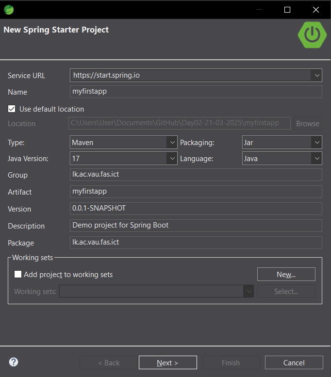
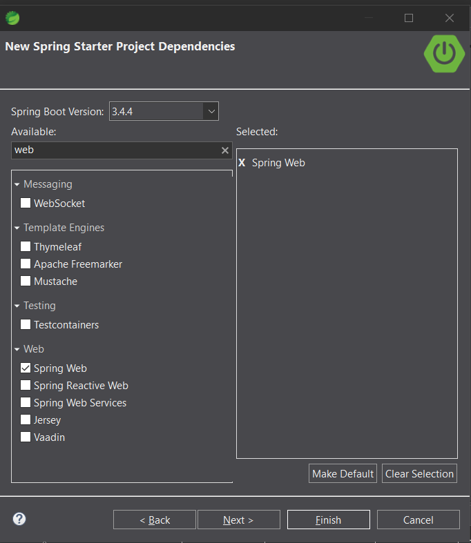

# Day02-21-03-2025

# First project using Spring Tools Project

## Project Overview
The project explores the basics of Spring Boot, including setting up a basic application and defining controllers.

## Features
- Spring Boot-based application

## Technologies Used
- Java
- Spring Boot
- Spring Tools
- Maven

## Access method
- Accessed the application at `http://localhost:8080`.

## Usage
- Endpoints:
  - `GET /app/msg` - returns "Hello SpringBoot" message.  
  - `GET /student/details` - returns student details.  
  

## Screenshots
### 1. Project creation

### 2. Student Controller responce

